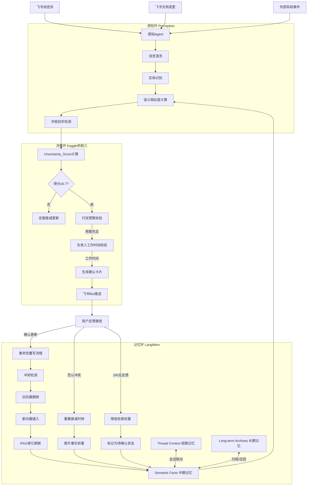
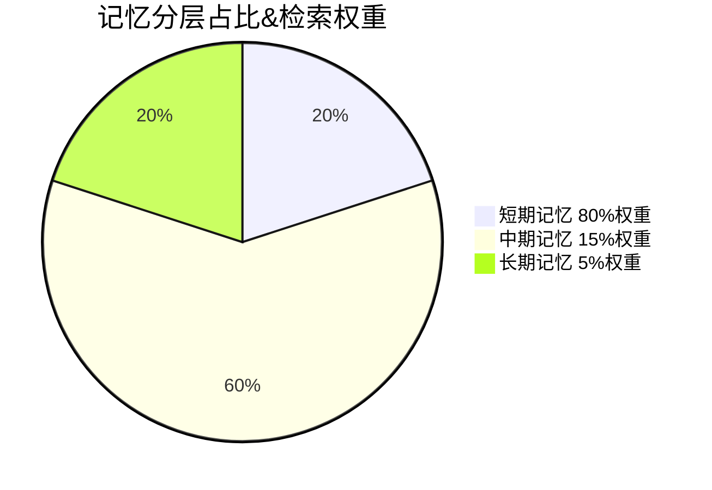
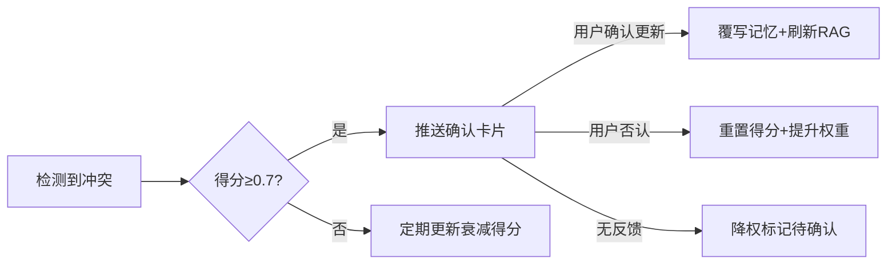
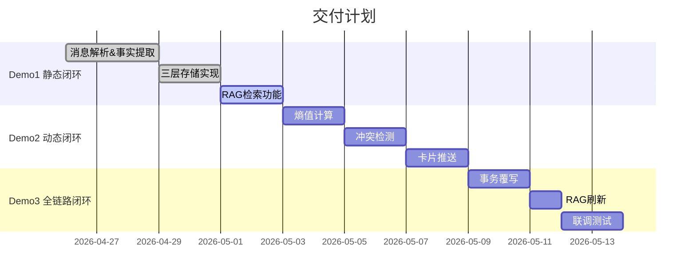

# 飞书长程记忆引擎架构设计（试行版，基于感知Agent暂时不尝试openclaw）

## 一、核心目标
解决RAG应用陈旧知识幻觉问题，实现记忆自动分层存储、动态更新、主动校准三大能力。

## 二、整体架构拓扑
系统由三大核心环路联动组成，全链路数据流向如下：



### 2.1 感知环 (Perception)
由感知Agent负责多源信息接入与预处理，初期不依赖OpenClaw：
- 飞书消息流实时监控
- 飞书文档变更捕获
- 感知Agent处理外部事件（代码库变更、第三方系统通知）
- 语义冲突初步检测

### 2.2 决策环 (Decision - Kaggle机制三实现)
核心控制逻辑：
- 维护每条事实的 Uncertainty_Score (不确定性得分)
- 时间衰减计算：$Score = 1 - e^{-\lambda \cdot \Delta T}$
- 冲突得分调整：新信息与旧事实语义不一致时大幅提升得分
- 阈值触发判断：得分超过0.7时触发主动干预流程
- 打扰预算控制：限制每日主动问询次数，优先处理高价值节点

### 2.3 记忆环 (Memory - LangMem实现)
记忆分层存储与管理：
- 短期记忆：Thread Context，存储当前会话原始Token
- 中期记忆：Semantic Facts，存储蒸馏后的结构化事实
- 长期记忆：Long-term Archives，存储验证过的静态常识
- 事务性覆写机制：确保记忆更新的原子性与一致性

## 三、核心模块说明

### 3.1 记忆分层存储


| 层级 | 内容 | 特性 |
|------|------|------|
| 短期 | 当前会话原始Token | 会话级存储，实时更新 |
| 中期 | 结构化事实实体 | 动态更新，核心记忆层 |
| 长期 | 静态团队常识 | 永久存储，低权重召回 |

### 3.2 核心规则
- **熵值计算**：$Score = 1 - e^{-\lambda \cdot \Delta T}$ + 冲突加成
- **触发阈值**：得分≥0.7触发主动确认
- **打扰控制**：每日上限5次，高优先级问题优先

### 3.3 更新流程


## 四、核心规范
### 4.1 事实标准字段
`实体类型 | 实体ID | 属性 | 值 | 来源 | 不确定性得分 | 负责人`

### 4.2 落地难点
| 问题 | 方案 |
|------|------|
| 打扰用户 | 每日5次上限，高优先级优先 |
| 语义对齐 | 统一Schema + 同义词映射 |
| 接入边界 | 初期仅接飞书消息、文档、代码提交 |
| 检索效率 | 分层召回，长期记忆低优先级 |

## 五、里程碑


## 六、技术栈
| 模块 | 选型 |
|------|------|
| 记忆存储 | LangMem + Milvus |
| 语义处理 | OpenAI Embedding |
| 飞书对接 | 开放平台API + 感知Agent |
| 后端 | FastAPI + Redis |
| 调度 | Celery 定时任务

## 七、数据流示例（项目上线日期变更场景）
### 示例背景
系统原有记忆：`项目A | project_A | 上线日期 | 2026-05-01 | 项目群消息ID:xxx | 0.1 | 张三`

---
```mermaid
flowchart TD
    1[群聊收到新消息："项目A上线时间调整到5月15号"] --> 2
    2[感知Agent提取新事实：项目A上线日期→2026-05-15] --> 3
    3[匹配到原有事实，语义冲突检测：不一致] --> 4
    4[熵值计算：原得分0.1 + 冲突加成0.5 = 0.6 < 0.7，暂不触发] --> 5
    5[10天后无其他验证信息，时间衰减后得分=0.72 ≥ 阈值] --> 6
    6[校验打扰预算剩余3次，张三当前为工作时间] --> 7
    7[推送卡片："项目A上线日期原记忆为5/1，近期提到5/15，是否更新？"] --> 8
    8{用户反馈} -->|确认更新| 9
    8 -->|否认| 10
    8 -->|24h无反馈| 11
    9[删除旧向量，插入新事实，刷新RAG索引] --> 12[后续检索返回5/15]
    10[重置熵值为0，验证次数+1，权重提升] --> 13[后续检索仍返回5/1]
    11[事实权重降低，检索时标注"待确认"]
```

## 八、核心量化指标
| 维度 | 指标 | 定义 
|------|------|------|--------|
| **知识一致性** | SSOT唯一事实源达成率 | 多次修改后系统返回最新正确决策的比例 
| | 冲突检出率 | 识别新输入与旧记忆矛盾的成功率 | ≥95% |
| **检索质量** | 背景感知召回率 | 正确返回信息所属项目背景和时间线的比例 
| | 抗干扰信噪比 | 大量噪音下核心记忆检索排名稳定性 | ≥0.8 |
| **效率体验** | 主动预警准确率 | 确认更新/误报骚扰的比例 
| | 人工维护削减量 | 相比手动更新Wiki节省的时间比例 
| | 用户满意度 | 主动问询功能的NPS评分 | ≥40分 | |
